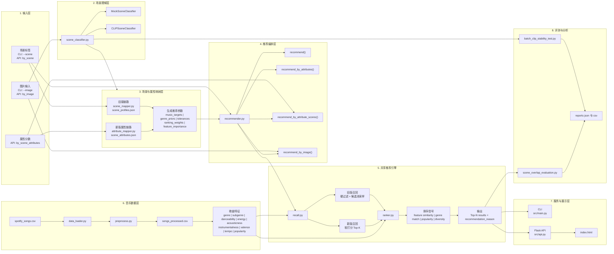
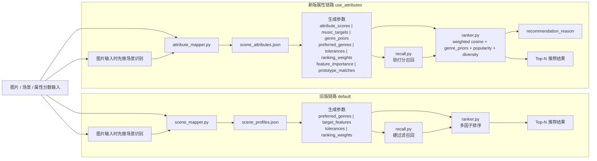

# 当前系统架构图

以下架构图基于当前代码实现整理，重点反映系统已经落地的双链路推荐结构、视觉识别模块、共享推荐引擎，以及 CLI / API 两种使用方式。

## 1. 系统总览图

## 2. 双链路细化图

## 3. 一句话说明

- 图片输入时，系统先经过 `scene_classifier.py` 做场景识别，再进入旧版场景映射链路或新版属性映射链路。
- 两条链路共享 `recall.py` 和 `ranker.py`，差别主要在于中间表示是否使用连续属性向量，以及召回和排序是否使用软分数。
- 当前新版属性链路已经接入 `genre_priors`、`feature_importance`、`recommendation_reason`，是项目后续继续优化的主线。
