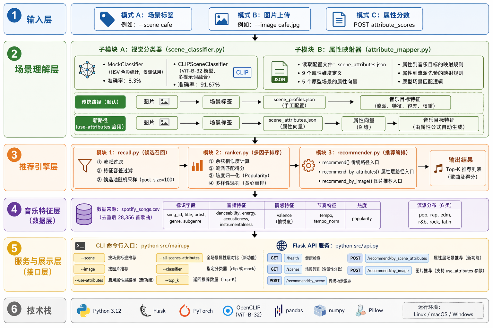

# 项目架构文档

---

## 一、目录结构总览

```text
01_music_recommendation/
├── configs/                         # 配置文件
│   ├── scene_profiles.json          # 旧版：场景→音乐特征映射（手工配置）
│   └── scene_attributes.json        # 新版：场景属性层（属性定义 + 原型 + prompt）
│
├── data/                            # 数据集
│   ├── sample_spotify/              # 原始 Spotify 歌曲数据
│   │   ├── spotify_songs.csv        #   28,356 首去重歌曲，6 个流派
│   │   └── readme.md
│   ├── processed/                   # 预处理后的歌曲数据
│   │   └── songs_processed.csv
│   ├── test_images/                 # 快速测试图片（每场景 1 张）
│   ├── test_images_real/            # 真实测试图片集（12 张，5 个场景）
│   └── archive.zip
│
├── models/                          # 模型权重（本地，不依赖在线下载）
│   └── clip/
│       └── ViT-B-32-laion2b_s34b_b79k/
│           └── open_clip_pytorch_model.bin
│
├── src/                             # 源代码
│   ├── main.py                      # CLI 入口
│   ├── api.py                       # Flask API 服务
│   ├── config.py                    # 全局路径与参数配置
│   ├── data_loader.py               # 数据加载
│   ├── preprocess.py                # 数据清洗、去重、标准化
│   ├── scene_mapper.py              # 旧版：scene_profiles.json 读取与映射
│   ├── attribute_mapper.py          # 新版：属性向量 → 音乐目标映射
│   ├── recall.py                    # 候选召回（流派 + 特征容差）
│   ├── ranker.py                    # 多因子排序（相似度 + 流派 + 热度 + 多样性）
│   ├── recommender.py               # 推荐编排（整合 recall + rank，双链路）
│   ├── test.py                      # 基础功能验证
│   └── vision/
│       └── scene_classifier.py      # 场景图像分类（Mock + CLIP）
│
├── scripts/                         # 工具脚本
│   ├── batch_clip_stability_test.py # CLIP 稳定性批量评测
│   └── download_sample_images.py    # Wikimedia Commons 图片下载
│
├── reports/                         # 评测报告输出
│   ├── clip_stability_test.json
│   ├── clip_stability_test.csv
│   ├── mock_stability_test.json
│   └── mock_stability_test.csv
│
├── doc/                             # 文档
│   ├── proposal.md                  # 项目总体构想
│   ├── detailed_proposal.md         # 详细实现方案（含属性层设计）
│   ├── current_progress.md          # 进度总结与下一步规划
│   ├── structure.md                 # 本文档：项目架构
│   └── ai_context_summary.md
│
├── requirements.txt
├── test_vision.py                   # 视觉模块快速验证
├── clip_check_result.txt
└── clip_status.txt
```

---

## 二、系统总体架构

```text
┌──────────────────────────────────────────────────────────────────────┐
│                           输入层                                      │
│  模式 A: 场景标签  (--scene cafe)                                     │
│  模式 B: 图片上传  (--image cafe.jpg)                                 │
│  模式 C: 属性分数  (POST attribute_scores)                            │
└───────────────────────────┬──────────────────────────────────────────┘
                            │
                            ▼
┌──────────────────────────────────────────────────────────────────────┐
│                         场景理解层                                    │
│                                                                      │
│  ┌─────────────────────────┐    ┌──────────────────────────────┐     │
│  │ 视觉分类器               │    │ 属性映射器 (attribute_mapper) │     │
│  │                         │    │                              │     │
│  │ MockClassifier          │    │ scene_attributes.json        │     │
│  │ (HSV 颜色统计，仅调试)    │    │   ├─ 9 个属性维度定义        │     │
│  │                         │    │   ├─ 5 个原型场景属性向量     │     │
│  │ CLIPSceneClassifier     │    │   ├─ 属性 → 音乐目标映射     │     │
│  │ (ViT-B-32, 多 prompt)   │    │   ├─ 属性 → 流派先验映射     │     │
│  │                         │    │   └─ 原型场景匹配            │     │
│  └─────────────────────────┘    └──────────────────────────────┘     │
│                                                                      │
│  旧版链路: 图片 → 场景标签 → scene_profiles.json → 音乐目标特征       │
│  新版链路: 图片 → 场景标签 → scene_attributes.json → 属性向量         │
│                                                      → 音乐目标特征  │
└───────────────────────────┬──────────────────────────────────────────┘
                            │
                            ▼
┌──────────────────────────────────────────────────────────────────────┐
│                        推荐引擎层                                     │
│                                                                      │
│  ┌─────────────────┐   ┌─────────────────┐   ┌──────────────────┐   │
│  │ recall.py       │   │ ranker.py       │   │ recommender.py   │   │
│  │                 │   │                 │   │                  │   │
│  │ ① 流派筛选      │   │ ① 余弦相似度    │   │ recommend()      │   │
│  │ ② 特征容差过滤   │   │ ② 流派匹配分    │   │ recommend_by_    │   │
│  │ ③ 候选池采样    │──▶│ ③ 流行度归一化  │──▶│   attributes()   │   │
│  │                 │   │ ④ 多样性惩罚    │   │ recommend_by_    │   │
│  │ pool_size=100   │   │                 │   │   image()        │   │
│  └─────────────────┘   └─────────────────┘   └──────────────────┘   │
└───────────────────────────┬──────────────────────────────────────────┘
                            │
                            ▼
┌──────────────────────────────────────────────────────────────────────┐
│                         音乐特征层                                    │
│                                                                      │
│  spotify_songs.csv (28,356 首)                                       │
│  ├─ song_id, title, artist, genre, subgenre                         │
│  ├─ danceability, energy, acousticness, instrumentalness            │
│  ├─ valence, tempo, tempo_norm, popularity                          │
│  └─ 6 个流派: pop / rap / edm / r&b / rock / latin                  │
└───────────────────────────┬──────────────────────────────────────────┘
                            │
                            ▼
┌──────────────────────────────────────────────────────────────────────┐
│                        服务与展示层                                   │
│                                                                      │
│  CLI 入口:  python src/main.py                                       │
│  ├─ --scene <name>              场景标签推荐                         │
│  ├─ --image <path>              图片推荐                             │
│  ├─ --use-attributes            启用属性层链路（新）                   │
│  ├─ --all-scenes-attributes     全场景属性层对比（新）                 │
│  ├─ --classifier clip|mock      指定分类器                           │
│  └─ --top_k <N>                 返回数量                              │
│                                                                      │
│  Flask API:  python src/api.py                                       │
│  ├─ GET  /health                                                   │
│  ├─ GET  /scenes                   场景列表（含属性分数）             │
│  ├─ POST /recommend/by_scene        旧版场景推荐                     │
│  ├─ POST /recommend/by_scene_attributes  属性层场景推荐（新）          │
│  └─ POST /recommend/by_image        图片推荐（支持 use_attributes）   │
└──────────────────────────────────────────────────────────────────────┘
```



---

## 三、双链路架构

当前推荐系统支持两条并行的推荐链路，通过 `--use-attributes` 参数切换。

### 3.1 旧版链路（默认）

```text
场景标签/图片
    │
    ▼
CLIP/Mock 分类器 ──→ 场景标签 (cafe/gym/...)
    │
    ▼
scene_profiles.json ──→ scene_mapper.py
    │                       ├─ preferred_genres
    │                       ├─ target_features
    │                       ├─ tolerances
    │                       └─ ranking_weights
    ▼
recall.py + ranker.py ──→ Top-N 推荐
```

| 特点     | 说明                                              |
| -------- | ------------------------------------------------- |
| 配置源   | `configs/scene_profiles.json`                   |
| 场景数量 | 5 个（cafe/gym/study_room/night_street/mountain） |
| 流派选择 | 手工指定 preferred_genres + preferred_subgenres   |
| 音乐特征 | 手工指定 target_features                          |
| 容差     | 手工指定 tolerances                               |
| 排序权重 | 手工指定 ranking_weights                          |
| 扩展性   | 新增场景需手动写完整配置                          |

### 3.2 新版链路（属性层，--use-attributes）

```text
场景标签/图片/属性分数
    │
    ▼
scene_attributes.json ──→ attribute_mapper.py
    │                       ├─ normalize_attribute_scores()
    │                       ├─ map_attributes_to_music_targets()
    │                       ├─ map_attributes_to_genre_priors()
    │                       ├─ map_attributes_to_tolerances()
    │                       ├─ get_attribute_ranking_weights()
    │                       ├─ build_target_array()
    │                       └─ match_scene_prototypes()
    │
    ├─ music_targets      (6 个音乐特征目标)
    ├─ genre_priors       (6 个流派先验分数)
    ├─ preferred_genres   (Top-3 筛选)
    ├─ tolerances         (容差参数)
    ├─ ranking_weights    (排序权重)
    ├─ target_array       (排序用特征向量)
    ├─ prototype_matches  (最近原型场景)
    └─ attribute_summary  (Top-3 属性摘要)
    │
    ▼
recall.py + ranker.py ──→ Top-N 推荐
```

| 特点     | 说明                                                                           |
| -------- | ------------------------------------------------------------------------------ |
| 配置源   | `configs/scene_attributes.json`                                              |
| 场景数量 | 5 个原型（可扩展）                                                             |
| 属性维度 | 9 个（arousal/socialness/focus/relaxation/nature/urban/night/openness/warmth） |
| 流派选择 | 属性向量 → 流派先验 → 自动筛选 Top-N                                         |
| 音乐特征 | 属性向量 → 加权映射公式 → 自动生成                                           |
| 容差     | 属性向量 → 自适应公式                                                         |
| 排序权重 | 属性向量 → 自适应计算                                                         |
| 扩展性   | 新增场景只需定义属性向量                                                       |

---

## 四、核心模块职责

| 模块           | 文件                                                  | 职责                                   | 关键函数                                                                 |
| -------------- | ----------------------------------------------------- | -------------------------------------- | ------------------------------------------------------------------------ |
| 配置           | [config.py](../src/config.py)                            | 全局路径、FEATURE_KEYS、默认参数       | —                                                                       |
| 数据加载       | [data_loader.py](../src/data_loader.py)                  | 读取 Spotify CSV                       | `load_sample_spotify_data()`                                           |
| 数据预处理     | [preprocess.py](../src/preprocess.py)                    | 清洗、去重、标准化、tempo_norm         | `preprocess_songs()`                                                   |
| 场景映射（旧） | [scene_mapper.py](../src/scene_mapper.py)                | 读取 scene_profiles.json，提供查询接口 | `get_scene_profile()`, `get_target_features()`                       |
| 属性映射（新） | [attribute_mapper.py](../src/attribute_mapper.py)        | 属性向量 → 音乐目标/流派/容差/权重    | `build_attribute_profile()`, `map_attributes_to_music_targets()`     |
| 候选召回       | [recall.py](../src/recall.py)                            | 流派筛选 + 特征容差过滤 + 候选池采样   | `recall()`, `recall_by_genre()`, `recall_by_features()`            |
| 排序           | [ranker.py](../src/ranker.py)                            | 多因子加权打分 + 多样性贪心重排        | `rank()`, `compute_cosine_similarity()`                              |
| 推荐编排       | [recommender.py](../src/recommender.py)                  | 整合召回与排序，双链路统一入口         | `recommend()`, `recommend_by_attributes()`, `recommend_by_image()` |
| 视觉分类       | [scene_classifier.py](../src/vision/scene_classifier.py) | 图片 → 场景标签（Mock/CLIP）          | `MockSceneClassifier.classify()`, `CLIPSceneClassifier.classify()`   |
| CLI 入口       | [main.py](../src/main.py)                                | 命令行参数解析与流程编排               | `main()`                                                               |
| API 服务       | [api.py](../src/api.py)                                  | Flask REST API                         | 5 个端点                                                                 |

---

## 五、数据流

### 5.1 数据加载流

```text
data/sample_spotify/spotify_songs.csv (32,833 行)
    │
    ▼ data_loader.load_sample_spotify_data()
    │
    ▼ preprocess.preprocess_songs()
    │     ├─ 去重（按 song_id）
    │     ├─ 流派标准化（小写化）
    │     ├─ 缺失值处理
    │     └─ tempo_norm 归一化
    │
    ▼ save_processed_songs()
    │
data/processed/songs_processed.csv (28,356 行)
```

### 5.2 推荐请求流（旧版）

```text
recommend("cafe", songs_df)
    │
    ▼ scene_mapper
    │     get_target_features()    → {danceability: 0.55, energy: 0.40, ...}
    │     get_preferred_genres()   → ["pop", "r&b"]
    │     get_tolerances()         → {energy: 0.20, ...}
    │     get_ranking_weights()    → {genre_match: 0.30, ...}
    │     get_target_array()       → [0.55, 0.40, 0.60, 0.10, 0.50, tempo_norm]
    │
    ▼ recall()
    │     recall_by_genre()        → 流派 + 子流派筛选
    │     recall_by_features()     → 特征容差区间过滤
    │     select_recall_pool()     → 随机采样至 pool_size
    │
    ▼ rank()
          compute_cosine_similarity()
          compute_genre_match_score()
          compute_popularity_score()
          多样性贪心重排
          → Top-N DataFrame
```

### 5.3 推荐请求流（新版属性层）

```text
recommend_by_attribute_scores(songs_df, scene_name="cafe")
    │
    ▼ build_attribute_profile()
    │     ├─ get_scene_attribute_scores("cafe")
    │     │     → {arousal: 0.35, socialness: 0.55, focus: 0.45, ...}
    │     ├─ map_attributes_to_music_targets()
    │     │     → {energy: 0.28, valence: 0.53, acousticness: 0.37, ...}
    │     ├─ map_attributes_to_genre_priors()
    │     │     → {pop: 0.39, r&b: 0.28, latin: 0.22, ...}
    │     ├─ select_preferred_genres() → ["pop", "r&b", "latin"]
    │     ├─ map_attributes_to_tolerances()
    │     ├─ get_attribute_ranking_weights()
    │     ├─ build_target_array()
    │     └─ match_scene_prototypes()
    │
    ▼ recommend_by_attributes()
    │     recall() + rank()
    │     → Top-N DataFrame
    │
    ▼ 返回
          {source_scene, attribute_scores, attribute_summary,
           genre_priors, music_targets, prototype_matches, results}
```

---

## 六、场景属性层设计

### 6.1 9 个属性维度

| # | 属性           | 含义            | 音乐影响方向                   |
| - | -------------- | --------------- | ------------------------------ |
| 1 | `arousal`    | 唤醒度/动感强度 | ↑ energy, tempo, danceability |
| 2 | `socialness` | 社交密度/互动感 | ↑ 流行感、律动感              |
| 3 | `focus`      | 专注导向        | ↓ energy, ↑ instrumentalness |
| 4 | `relaxation` | 放松感/舒缓感   | ↓ 节奏, ↑ acousticness       |
| 5 | `nature`     | 自然感          | ↑ acoustic, folk, ambient     |
| 6 | `urban`      | 都市感/人造环境 | ↑ pop, r&b, edm, rap          |
| 7 | `night`      | 夜晚感/暗色氛围 | ↑ r&b, chill, synthwave       |
| 8 | `openness`   | 空间开阔度      | ↑ 铺展、开阔的听感            |
| 9 | `warmth`     | 温暖亲和感      | ↑ valence, 偏柔和舒适         |

### 6.2 属性 → 音乐目标映射（简化）

```text
target_energy    = 0.55×arousal + 0.15×socialness - 0.20×focus + 0.05×urban
target_valence   = 0.30×relaxation + 0.20×warmth + 0.15×nature + ...
target_tempo     = 70 + 60×arousal + 10×urban - 12×focus - 8×relaxation
target_acoustic  = 0.35×nature + 0.25×relaxation + 0.20×focus - 0.20×urban - 0.15×arousal
target_instrum   = 0.35×focus + 0.20×relaxation + 0.15×nature - 0.20×socialness - 0.15×arousal
target_dance     = 0.40×arousal + 0.25×socialness + 0.15×urban - 0.15×focus
```

---

## 七、技术栈

| 层级     | 技术                                   |
| -------- | -------------------------------------- |
| 语言     | Python 3.12                            |
| 数据处理 | pandas, numpy                          |
| 视觉模型 | OpenCLIP (ViT-B-32, laion2b_s34b_b79k) |
| 深度学习 | PyTorch, torch                         |
| 图片处理 | Pillow                                 |
| Web 框架 | Flask                                  |
| 机器学习 | scikit-learn                           |
| 依赖管理 | pip + requirements.txt                 |

---

## 八、关键设计决策

| 决策           | 说明                                                       |
| -------------- | ---------------------------------------------------------- |
| CLIP 本地权重  | 不依赖 HuggingFace 在线下载，权重放在 `models/clip/`     |
| 多 prompt 集成 | 每场景 3 句描述性 prompt，取 max 相似度                    |
| Mock 分类器    | 基于 HSV 颜色统计，仅用于链路调试，准确率 8.3%             |
| 双链路并存     | 旧版 scene_profiles + 新版 scene_attributes 并行，互不破坏 |
| 属性层 opt-in  | 默认走旧链路，显式传 `--use-attributes` 才走属性层       |
| 召回容错       | 特征过滤结果过少时自动 2× 放宽阈值                        |
| 流派回退       | 按流派筛选结果过少时回退到全量歌曲                         |
| 多样性贪心     | 逐首选择时对已出现歌手/流派施加递减惩罚                    |
